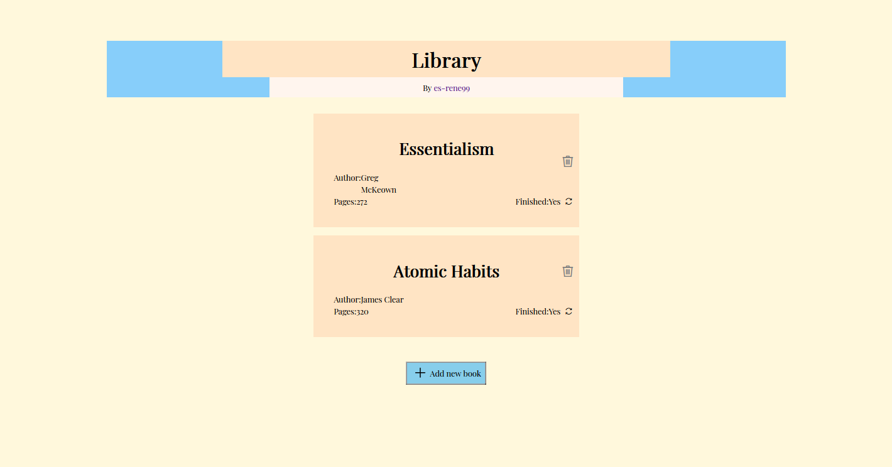

# Library

 

<table align="center" border="0" >
  <tr>
    <td>
      
    </td>
    <td>
      
    </td>
    </table>
  

 

One of my projects from The Odin's Project curriculum, it works both on mobile and desktop.

It allows you to make records of books you have already read, and it stores it in the localStorage of your browser.
